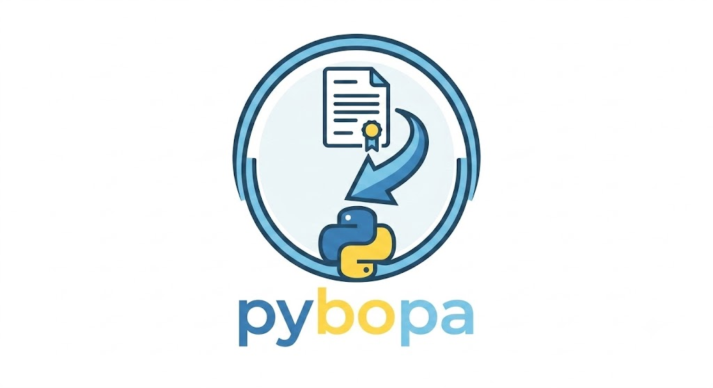

# py-bopa Documentation

py-bopa is a Python library for searching and managing official bulletins,
focused on the BOPA (Boletín Oficial del Principado de Asturias).

    

## Why py-bopa?

BOPA (Boletín Oficial del Principado de Asturias) is the official gazette of the region of Asturias, Spain. Researchers, legal professionals, and journalists often need to search, download, and analyze large volumes of legislative and administrative documents. **py-bopa** provides a simple, programmatic interface to:

- Retrieve bulletin summaries and articles as structured Python objects.
- Search across date ranges for both bulletins and individual articles.
- Export data to dictionaries for integration with data analysis pipelines (pandas, NumPy, etc.).
- Avoid manual scraping by handling HTML parsing and URL construction internally.

> [!WARNING]
> BOPA bulletins are available in the portal from **01/01/2000** onwards. Requests for earlier dates will return no data.

## Main features

- **Structured data models**: `BulletinSummary`, `BulletinSummaryEntry`, and `BulletinArticle` dataclasses with `to_dict()` serialization.
- **Querying capabilities**: Search for bulletin summaries and specific articles.
- **Parameterized filtering**: Filter articles and bulletins by text content, origin, or code.

## Use Cases

- **Legal research**: Download and analyze official bulletins for a specific time period to track legislative changes.
- **Data journalism**: Collect structured data from BOPA for investigative reporting on regional governance.
- **Policy analysis**: Extract and categorize dispositions by origin (council, council board, presidency, etc.) for quantitative studies.
- **Archive building**: Build reproducible datasets of Asturian official publications for academic research.

## Citation
